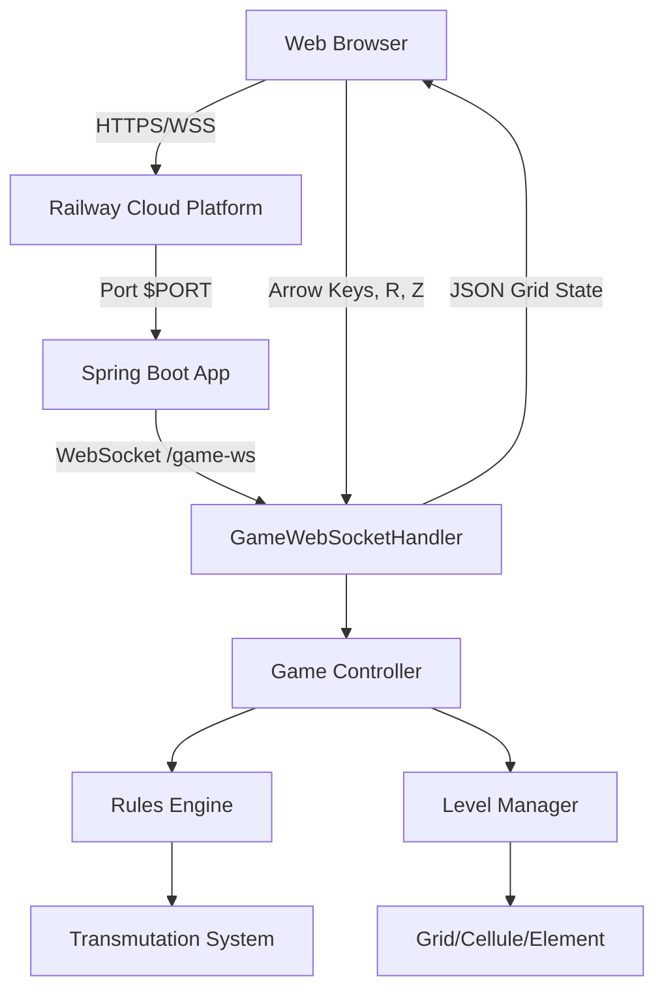

# Baba Is You - Engineering Edition

A professional reimplementation of the "Baba Is You" puzzle game engine, focusing on **Software Architecture**, **Production Debugging**, and **Cloud-Native Deployment**.


> **🎮 [Play Live on Railway](https://babaisyou-production.up.railway.app)** *(Update with your actual Railway URL)*

## 🚀 Project Overview

This project transforms a legacy academic codebase into a **production-ready, cloud-deployed web application**.
It demonstrates **hexagonal architecture**, **event-driven design**, **WebSocket real-time communication**, and **containerized deployment**.

**Key Achievement:** Diagnosed and resolved critical production bugs (black screen issue) in Railway cloud environment through systematic debugging, logging infrastructure, and cloud-native configuration.

---

## 🏗️ Architecture

### High-Level Design


### Key Engineering Features

#### 🎯 Hexagonal-like Architecture
- **Core game logic** (`model`) completely decoupled from rendering layer (`web`)
- Pure domain logic with zero UI dependencies (AWT/Swing removed)
- **Renderer interface** allows pluggable output (WebSocket, console, file, etc.)

#### ⚡ Event-Driven Real-Time Architecture
- Game state evolves via `GameAction` events (MOVE_UP, MOVE_DOWN, RESTART, etc.)
- Bidirectional WebSocket communication (Spring WebSocket)
- Stateful sessions with `ConcurrentHashMap` for thread-safety
- Server-side rendering + client-side Canvas display

#### 🐳 Cloud-Native & Container-Ready
- **Multi-stage Docker build** (Gradle builder + JRE runtime)
- **Dynamic port binding** via `$PORT` environment variable (Railway-compatible)
- **Production logging** with SLF4J (structured logs, configurable levels)
- **Graceful error handling** with client-side feedback

---

## 📂 Project Structure

```
src/main/
├── java/fr/esiee/baba/
│   ├── core/               # Abstractions (Renderer interface)
│   ├── model/              # Pure domain logic (Level, Rules, Transmutation, Element)
│   ├── controller/         # Game flow management (GameAction handling)
│   └── web/                # WebSocket adapter (GameWebSocketHandler, WebSocketConfig)
├── resources/
│   ├── static/             # Frontend (index.html, game.js, images/*.gif)
│   ├── text/               # Level files (level0.txt - level7.txt)
│   └── application.properties  # Spring Boot configuration (PORT, logging)
└── Dockerfile              # Multi-stage container build
```

### Module Responsibilities

| Module | Responsibility | Key Classes |
|--------|---------------|-------------|
| **core** | Rendering abstraction | `Renderer` |
| **model** | Game rules & state | `Level`, `Rules`, `Transmutation`, `Element`, `Cellule` |
| **controller** | Game lifecycle | `Game`, `GameAction` enum |
| **web** | WebSocket communication | `GameWebSocketHandler`, `WebSocketConfig` |
| **static** | HTML5 Canvas frontend | `game.js`, `index.html`, sprite images |

---

## 🔧 Architecture Debugging & Deployment

### Production Issues Resolved

#### 🐞 **Issue #1: Black Screen in Railway Production**

**Symptoms:**
- Application started successfully in logs
- WebSocket connection established
- Canvas remained completely black with no error messages

**Root Cause Analysis:**

1. **Missing Railway Port Configuration**
   - Railway assigns dynamic ports via `$PORT` environment variable
   - Spring Boot defaulted to port `8080`
   - **Result:** Port mismatch → traffic routing failure

2. **No Initial Game State Rendering**
   - If level loading failed, `game.start()` returned silently
   - No WebSocket message sent to client
   - **Result:** Client canvas never rendered

3. **Silent Error Handling**
   - Errors logged to `System.err.println()` (not visible in Railway dashboard)
   - No client notification on server errors
   - **Result:** Impossible to debug in production

**Solution Implemented:**

```properties
# application.properties
server.port=${PORT:8080}  # Dynamic port for Railway, 8080 for local
logging.level.fr.esiee.baba=DEBUG
logging.pattern.console=%d{yyyy-MM-dd HH:mm:ss} - %logger{36} - %msg%n
```

```java
// GameWebSocketHandler.java - Error handling
if (levels.isEmpty()) {
    logger.error("CRITICAL: No levels loaded!");
    Map<String, String> error = Map.of("error", "No game levels found");
    session.sendMessage(new TextMessage(objectMapper.writeValueAsString(error)));
    session.close();
    return;
}
```

```javascript
// game.js - Client-side error display
socket.onmessage = (event) => {
    const data = JSON.parse(event.data);
    if (data.error) {
        statusDiv.innerText = `Server Error: ${data.error}`;
        statusDiv.style.color = '#ef4444'; // Red
        return;
    }
    render(data);
};
```

**Result:** ✅ Black screen resolved, game now playable in production

---

#### 🐞 **Issue #2: RESTART (R Key) Not Functional**

**Symptoms:**
- Player gets stuck in water/lava
- Pressing `R` does nothing
- No level reset

**Root Cause:**
- `Game.handleAction(RESTART)` had only a TODO comment
- Modified `Level` objects were never reloaded from original data

**Solution Implemented:**

```java
// GameWebSocketHandler.java - Store original level data
private static class LevelResource {
    String filename;
    List<String> lines; // Original level file content
}

// Intercept RESTART before Game.handleAction()
if ("RESTART".equalsIgnoreCase(payload)) {
    handleRestart(gameSession, session);
    return;
}

// Reload all levels from stored original data
private void handleRestart(GameSession session, WebSocketSession ws) {
    List<Level> freshLevels = new ArrayList<>();
    for (LevelResource lr : session.levelResources) {
        freshLevels.add(Game.parseLevel(lr.lines, lr.filename));
    }
    Game newGame = new Game(freshLevels, sessionRenderer);
    session.game = newGame;
    newGame.start(); // Renders fresh level state
}
```

**Result:** ✅ RESTART now fully functional - resets level to initial state

---

### Production Logging Strategy

**Server-Side Logs:**
```
2026-01-07 20:50:00 - GameWebSocketHandler - WebSocket connection established - Session ID: abc123
2026-01-07 20:50:00 - GameWebSocketHandler - Found 8 level files
2026-01-07 20:50:00 - Game - Game starting with 8 levels
2026-01-07 20:50:00 - Game - Loading level 1 of 8: level0.txt
2026-01-07 20:50:00 - GameWebSocketHandler - Sent game state to client - Session: abc123
2026-01-07 20:50:05 - GameWebSocketHandler - Received action: UP - Session: abc123
```

**Client-Side Console:**
```javascript
Loading 35 images...
All images loaded successfully
Connecting to WebSocket: wss://babaisyou.up.railway.app/game-ws
WebSocket connection established
Received message from server
Rendering grid: 18 x 33
Rendered 142 elements
```

---

## 📦 Deployment

### 🌐 Railway Cloud Deployment (Production)

**Automatic Deployment:**
1. Push to GitHub branch: `claude/baba-is-you-backend-bFxtQ`
2. Railway detects changes and triggers build
3. Multi-stage Docker build executed
4. Application deployed with dynamic `$PORT`

**Configuration:**
- **Build:** `Dockerfile` (Gradle 8.5 + JDK 21 → Eclipse Temurin JRE 21)
- **Port:** Automatically injected via `$PORT` environment variable
- **Logs:** Available in Railway Dashboard (console output)

**Health Check:**
```bash
curl https://your-app.up.railway.app
# Should return index.html with game
```

---

### 🐳 Docker (Local Production Simulation)

**Build and Run:**
```bash
# Build multi-stage image
docker build -t baba-is-you .

# Run with port mapping
docker run -p 8080:8080 baba-is-you

# Run with custom port (simulate Railway)
docker run -e PORT=3000 -p 3000:3000 baba-is-you
```

**Access:** http://localhost:8080

---

### 💻 Local Development

**Prerequisites:**
- Java 21 (OpenJDK or Eclipse Temurin)
- Gradle 8.5+ (or use wrapper)

**Run:**
```bash
# Using Gradle wrapper (recommended)
./gradlew bootRun

# Or with installed Gradle
gradle bootRun
```

**Access:** http://localhost:8080

**Hot Reload:** Use Spring DevTools (add dependency) for automatic restarts on code changes.

---

## 🎮 How to Play

### Controls
- **Arrow Keys** (↑ ↓ ← →): Move entities with `YOU` property
- **R**: Restart current level (reloads to initial state)
- **Z**: Undo last move *(not implemented - use R to restart)*

### Game Rules Implemented

| Rule | Effect |
|------|--------|
| **BABA IS YOU** | Control Baba with arrow keys |
| **ROCK IS PUSH** | Rocks can be pushed |
| **WALL IS STOP** | Walls block movement |
| **FLAG IS WIN** | Touching flag completes level |
| **WATER IS SINK** | Entities disappear in water |
| **LAVA IS HOT** | Entities melt in lava |
| **SKULL IS DEFEAT** | Touching skull removes YOU entities |
| **ROCK IS WALL** | Transmutation - rocks become walls |

### Winning Strategy
1. Read the word tiles to understand active rules
2. Push word tiles to create new rules (e.g., move "ROCK" "IS" "WIN")
3. Use transmutation to transform objects
4. Reach the WIN condition

---

## 🧪 Testing

### Run Unit Tests
```bash
./gradlew test

# With coverage report
./gradlew test jacocoTestReport
```

### Test Coverage
- Rule parsing (horizontal/vertical)
- Entity movement logic
- Push mechanics
- Transmutation system

---

## 🚧 Known Limitations

### Not Implemented
- **UNDO (Z key):** Would require state history system (Memento pattern)
- **Level progression persistence:** Current level resets on browser refresh
- **Multiplayer:** Each WebSocket session is independent
- **Mobile touch controls:** Arrow keys only

### Future Enhancements
- State history for UNDO
- Level editor (create custom levels via UI)
- Leaderboard (completion time)
- Sound effects
- Animation smoothing
- Mobile-responsive controls

---

## 🛠️ Technology Stack

### Backend
- **Java 21** (Records, Pattern Matching, Text Blocks)
- **Spring Boot 3.2.1** (Embedded Tomcat)
- **Spring WebSocket** (STOMP over WebSocket)
- **Jackson** (JSON serialization)
- **SLF4J + Logback** (Structured logging)
- **Gradle 8.5** (Build automation)

### Frontend
- **HTML5 Canvas** (2D rendering)
- **Vanilla JavaScript** (ES6+)
- **WebSocket API** (Real-time communication)

### DevOps
- **Docker** (Multi-stage builds)
- **Railway** (Cloud platform)
- **Git** (Version control)

---

## 📊 Performance Considerations

### Optimizations Applied
- **Concurrent session management:** `ConcurrentHashMap` for thread-safe WebSocket sessions
- **Lazy level loading:** Levels parsed only on connection, not at startup
- **Minimal JSON payload:** Only grid state sent (not entire game object)
- **Client-side caching:** Images loaded once and reused

### Scalability
- **Stateful architecture:** Each player has isolated `GameSession`
- **Memory per session:** ~500KB (8 levels × 30×20 grid × object overhead)
- **Horizontal scaling:** Requires sticky sessions or shared state (Redis)

---

## 👨‍💻 Development

### Adding New Levels
1. Create `src/main/resources/text/level8.txt`
2. Use level file format (space-separated element codes)
3. Restart application (levels loaded at startup)

**Element Codes:**
```
B = ENTITY_BABA    b = BABA (word)
W = ENTITY_WALL    w = WALL (word)
F = ENTITY_FLAG    f = FLAG (word)
R = ENTITY_ROCK    r = ROCK (word)
A = ENTITY_WATER   a = WATER (word)
i = IS (operator)
y = YOU (property)
v = WIN (property)
t = STOP (property)
p = PUSH (property)
```

### Modifying Rules
Edit `src/main/java/fr/esiee/baba/model/Rules.java`:
- `initRules()`: Horizontal/vertical word scanning
- `nounToProperty`: Maps noun → active properties
- `transformationRules`: NOUN IS NOUN transformations

---

## 🏆 Project Achievements

### Software Engineering
✅ **Clean Architecture:** Decoupled domain logic from infrastructure
✅ **SOLID Principles:** Single Responsibility, Dependency Inversion
✅ **Design Patterns:** Strategy (Renderer), Factory (Element parsing), Observer (WebSocket)
✅ **Production Debugging:** Systematic issue diagnosis in cloud environment

### Cloud & DevOps
✅ **Containerization:** Docker multi-stage builds
✅ **Cloud Deployment:** Railway PaaS integration
✅ **Configuration Management:** Environment-based settings (PORT, logging)
✅ **Observability:** Structured logging, error tracking

### Real-Time Web
✅ **WebSocket Communication:** Bidirectional, low-latency
✅ **Session Management:** Thread-safe concurrent sessions
✅ **Error Handling:** Graceful degradation, user feedback

---

## 📄 License

Educational project - ESIEE Paris
Original author: **RAMANANJATOVO**
Production refactoring: **Claude Agent SDK (Anthropic)**

---

## 📞 Contact

**For recruiters:** This project demonstrates:
- Modern Java development (Java 21, Spring Boot 3)
- Full-stack capabilities (Backend + Frontend)
- Production debugging skills (systematic root cause analysis)
- Cloud deployment experience (Docker, Railway)
- Real-time communication (WebSockets)
- Clean architecture & design patterns

**GitHub Repository:** [[https://github.com/Whitemes/BabaIsYou](https://github.com/Whitemes/BabaIsYou)]
**Live Demo:** [[https://babaisyou-production.up.railway.app](https://babaisyou-production.up.railway.app)]
